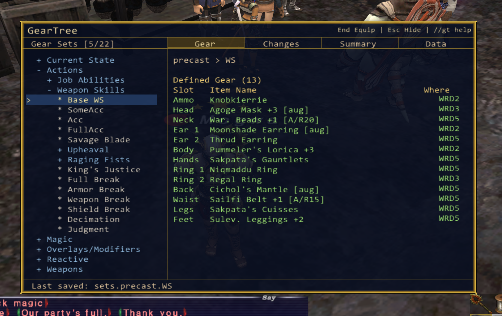
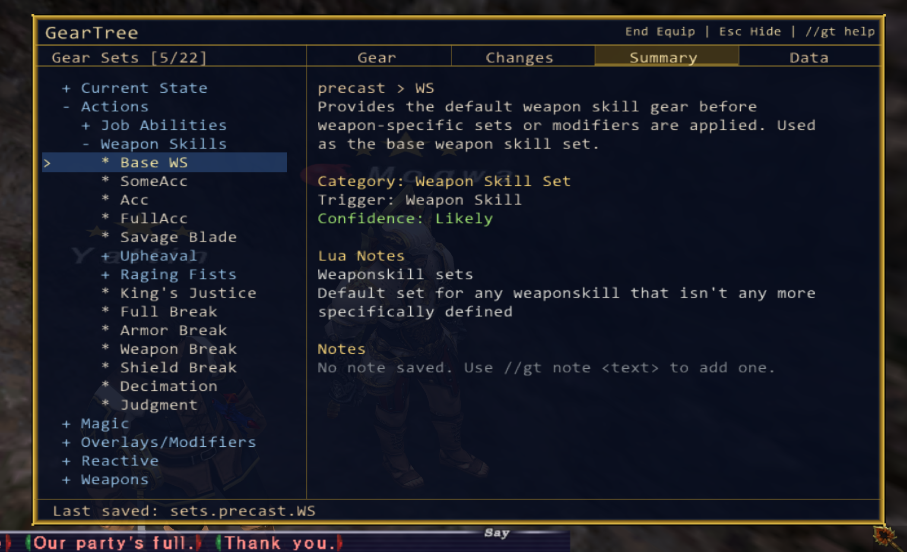
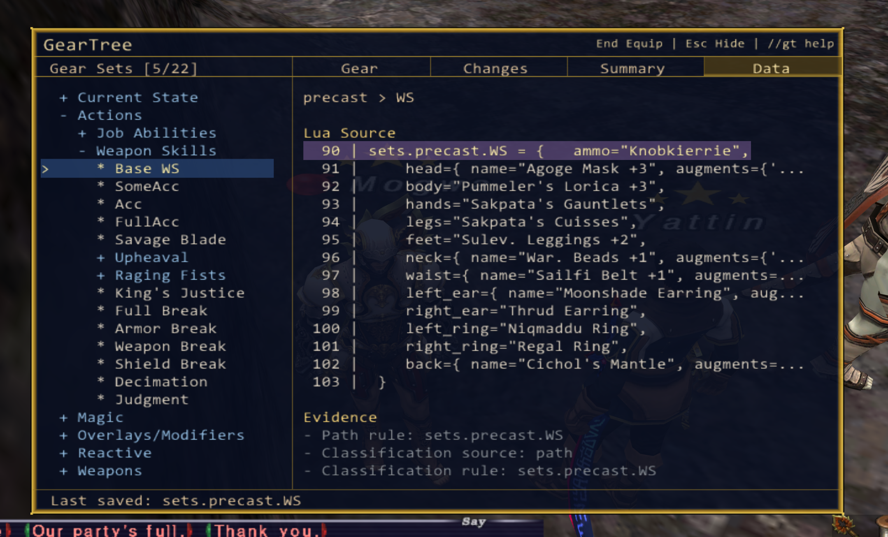

# GearTree

GearTree is a Windower addon that transforms GearSwap Lua files into an interactive gear management system inside Final Fantasy XI.

Instead of digging through hundreds or thousands of lines of Lua, GearTree lets you browse, organize, inspect, and update gear sets directly from the game.



---

## Why GearTree?

Large GearSwap files become difficult to navigate, maintain, and update over time.

GearTree provides:

* Organized set browsing
* Raw GearSwap navigation
* Gear inspection
* Personal notes
* Virtual folders
* Save-back support
* Automatic backups
* Undo functionality
* Mouse and keyboard navigation
* Click Lock to prevent clicks from passing through to FFXI
* UI scaling and customization

Whether you maintain a simple job file or a highly customized endgame setup, GearTree makes managing gear significantly easier.

---

## Features

### Organized Tree View

Browse gear sets through gameplay-focused categories instead of hunting through Lua files.

Examples include:

* Weapon Skills
* Idle Sets
* Engaged Sets
* Defensive Sets
* Utility Sets
* Reactive Sets
* Magic Sets

Perfect for large GearSwap files with dozens or hundreds of sets.

### Save Directly Back To GearSwap

Update gear in-game and write changes directly back into your GearSwap Lua.

No manual editing required.

### Automatic Backups & Undo

Every save creates a backup automatically.

Restore the previous save with:

`//gt undo`

### Notes and Organization

Attach notes to sets and folders for:

* Upgrade planning
* Farming goals
* Build explanations
* Future gear upgrades
* Personal reminders

GearTree also reads `--` comments written directly above a set in your Lua file and displays them automatically as **Lua Notes** on the set's summary. These are read-only — GearTree never modifies your source comments.

For example, a set like this:

```lua
-- Weaponskill sets
-- Default set for any weaponskill that isn't any more specifically defined
sets.precast.WS = { ... }
```

will show that comment in the Notes section without any extra steps.



### Gear Inspection

Inspect equipment, inventory location, missing items, and additional set information.



### Source Navigation

Jump directly to the Lua source line for any highlighted set:

`//gt open`

or

`//gt source`

GearTree will open the file in your editor at the line where that set is defined.

**Editor auto-detection order:**

1. VS Code (if `code` is in your PATH)
2. Notepad++ (if installed or in PATH)
3. Sublime Text (if `subl` is in your PATH)
4. Windows default `.lua` file association

**To set a specific editor**, add `source_editor_command` to your settings file at:

```
Windower/addons/GearTree/data/settings.xml
```

Examples:

```xml
<source_editor_command>code -g "{file}:{line}"</source_editor_command>
```

```xml
<source_editor_command>notepad++ -n{line} "{file}"</source_editor_command>
```

```xml
<source_editor_command>subl "{file}:{line}"</source_editor_command>
```

Use `{file}` and `{line}` as placeholders. If the configured command fails, GearTree falls back to auto-detection.

---

### Mouse and Keyboard Navigation

Navigate GearTree with the mouse, keyboard, or both.

**Shift+Arrow navigation** is on by default. Plain arrow keys pass through to FFXI for camera and menu control. Hold Shift to navigate GearTree:

| Key | Action |
|-----|--------|
| Shift+Up / Shift+Down | Move cursor up/down |
| Shift+Right | Expand folder or equip set |
| Shift+Left | Collapse folder or go back |

Turn off Shift+Arrow mode if you prefer plain arrows to control GearTree:

`//gt shift off`

---

**Click Lock** prevents mouse clicks from passing through to FFXI while the cursor is over GearTree. Clicks outside GearTree pass through to the game as normal. On by default.

`//gt clicklock off` — turn off Click Lock

`//gt clicklock on` — turn it back on

`//gt clicklock toggle` — flip the current state

---

**Visual cursor overlay** shows a crosshair while the mouse is inside GearTree. On by default.

---

### 0.4.1 Upgrade Note

In 0.4.1, Click Lock and Shift Mode default ON for new installs. Existing users with a saved settings file may need to enable them manually:

```
//gt clicklock on
//gt shift on
```

`//gt cursor off`

### UI Customization

Scale the interface:

`//gt scale 1.25`

Adjust opacity:

`//gt opacity 75`

Toggle cursor overlay:

`//gt cursor on`

### Organized and Raw Views

Switch between:

* Organized View (gameplay-focused categories)
* Raw View (original GearSwap structure)

depending on how you prefer to manage your sets.

---

## Help

Player commands:

`//gt help`

Advanced and developer commands:

`//gt devhelp`

---

## Requirements

* Windower
* GearSwap

---

## Current Version

**GearTree 0.4.0**
